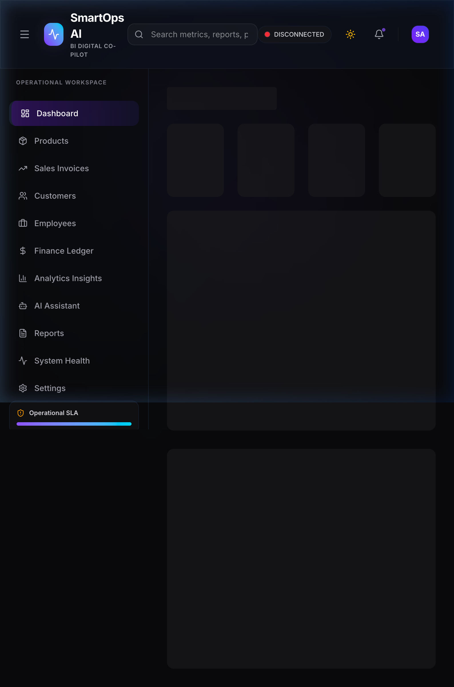
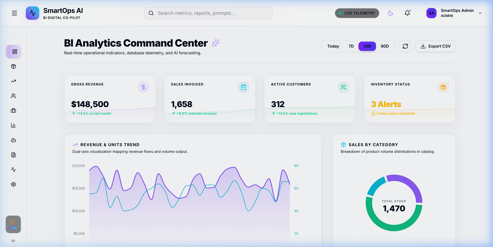
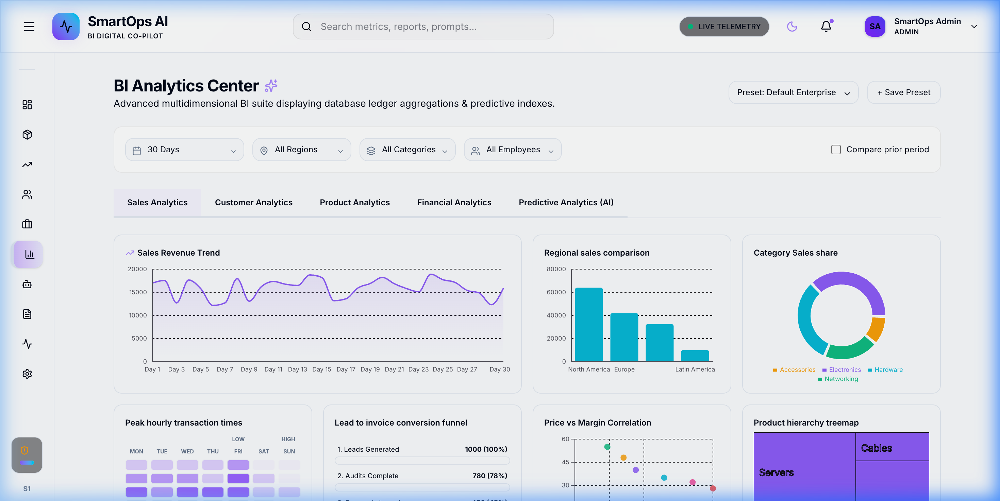
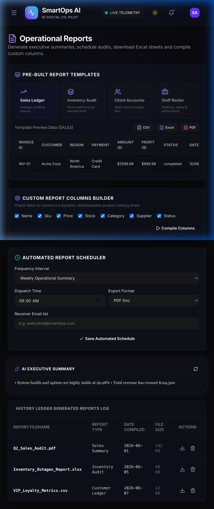
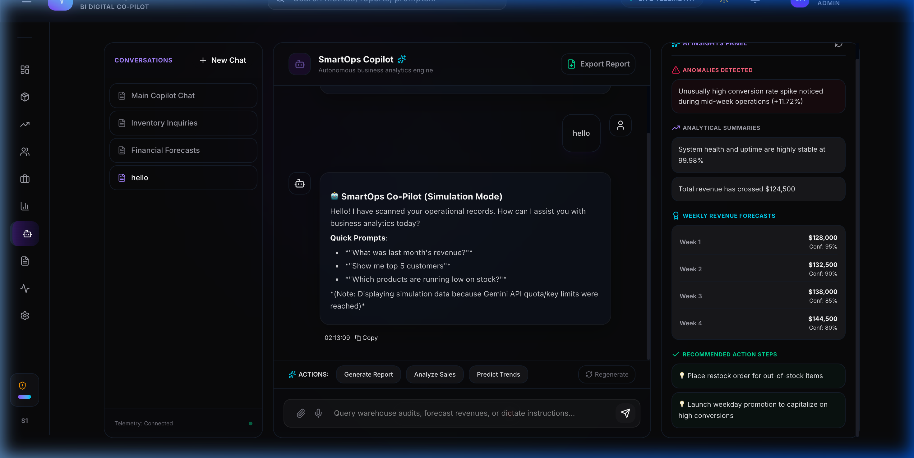
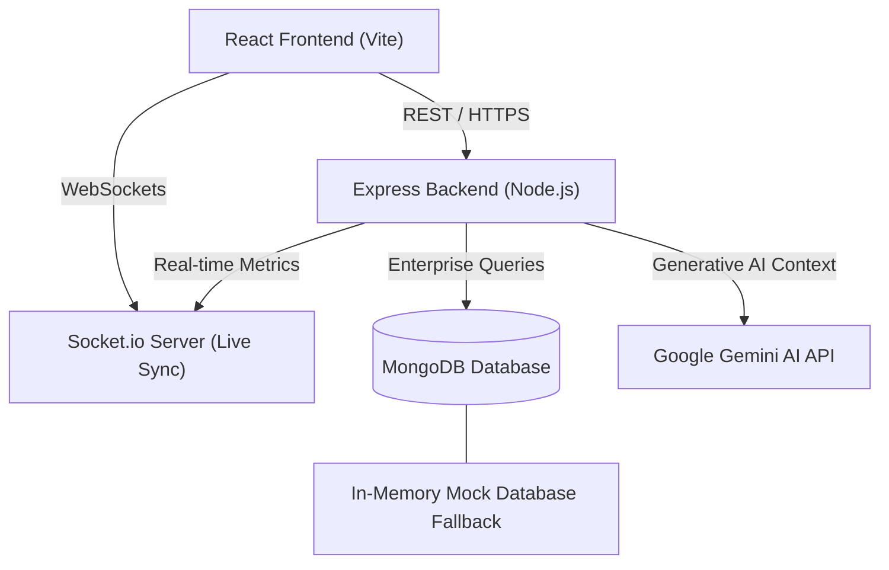

# SmartOps AI 🚀

[](https://www.mongodb.com/mern-stack)
[](https://react.dev)
[](https://nodejs.org)
[](https://expressjs.com)
[](https://www.mongodb.com)
[](https://ai.google.dev/)
[](https://socket.io)

**SmartOps AI** is an enterprise-grade Operations Command Center and Business Intelligence (BI) dashboard designed to provide real-time operational insights, telemetry data, predictive analysis, and automated decision support. Empowered by Google Gemini AI, it functions as a digital copilot for business managers—enabling natural language database queries, report generation, and interactive data visualization.

---

## 🖥️ High-Fidelity UI Showcase

#### Operations Command Center (Dashboard)
Track live sales, profit, revenue fluctuations, and system metrics in real-time. Supports full dark and light mode layouts:

| 🎛️ Dark Mode | ☀️ Light Mode |
|:---:|:---:|
|  |  |

#### Deep Business Analytics & Insights
Generate interactive visualizations, check regional performance, track low-stock inventory thresholds, and review segmentations:


#### Operational Reports & AI Co-pilot Chat
Query database records via natural language chat or export formatted PDF reports for audit verification:

| 📋 PDF & Data Reports | 🤖 AI Assistant Chat |
|:---:|:---:|
|  |  |

---

## 🌟 Key Features

* **🤖 Interactive AI Copilot**: Chat with your enterprise data in plain English. Get instant metrics analysis, reports, or insert new mock database items using the Google Gemini model.
* **⚡ Real-Time Telemetry & Sync**: Instant KPI updates, system uptime broadcasts, and live notifications powered by Socket.io.
* **📈 Dynamic Business Charts**: Zoomable, filterable, interactive charts (sales trends, product volume, customer distributions, and region matrices) built using Recharts & Chart.js.
* **🔒 Multi-Role Security**: Role-based access control (Admin, Viewer) secured by JSON Web Tokens (JWT) and bcrypt hashing.
* **📥 CSV Data Importer**: Upload sales lists, products inventory, or client databases for immediate analysis and dashboard updates.
* **💫 Premium Dark & Light Themes**: Styled with HSL variable systems, glassmorphic layouts, and Framer Motion micro-animations.
* **🐳 Containerization Ready**: Clean Docker Compose configuration supporting one-command local deployments.
* **🔄 Database Resiliency**: Automatic backend fallback to in-memory data structures if MongoDB is temporarily unreachable, maintaining service reliability.

---

## 🏗️ Architecture & Data Flow



---

## 📂 Project Structure

```bash
smartops-ai/
├── client/                          # React + Vite frontend
│   ├── src/
│   │   ├── components/              # Reusable layout, charts, AI chat widgets
│   │   ├── pages/                   # Main views (Dashboard, Sales, Employees, Reports, Analytics)
│   │   ├── context/                 # Context providers (Sockets, Auth, Themes)
│   │   ├── hooks/                   # Custom React utility hooks
│   │   └── services/                # Axios API call modules
│   ├── public/                      # Static client assets
│   └── package.json
├── server/                          # Express + Node.js backend
│   ├── config/                      # Database (Mongoose) & Socket configuration
│   ├── controllers/                 # Express route handlers
│   ├── middleware/                  # JWT auth, error handlers, rate-limiters
│   ├── models/                      # MongoDB/Mongoose schemas
│   ├── routes/                      # API endpoint definitions
│   ├── services/                    # Gemini AI service layer & DB Tool definitions
│   ├── docs/                        # API Specification docs (API.md)
│   └── server.js                    # Server entry point
├── assets/                          # Product screenshots & visual elements
├── CONTRIBUTING.md                  # Developer guidelines & commit standards
├── docker-compose.yml               # Multi-container orchestration configurations
└── README.md                        # Project documentation
```

---

## ⚡ Quickstart

### Prerequisites
* **Node.js** (v18 or higher)
* **MongoDB** (Local instance or MongoDB Atlas Connection String)
* **Google Gemini API Key** (Obtain from [Google AI Studio](https://aistudio.google.com/))

### 1. Backend Setup

1. Navigate to the server folder:
   ```bash
   cd server
   ```
2. Initialize environment parameters:
   ```bash
   cp .env.example .env
   ```
3. Populate variables in the `.env` file:
   ```env
   PORT=5005
   MONGODB_URI=mongodb://localhost:27017/smartops
   JWT_SECRET=your_super_secret_jwt_key
   JWT_EXPIRE=7d
   GEMINI_API_KEY=your_google_gemini_api_key
   NODE_ENV=development
   CLIENT_URL=http://localhost:5173
   ```
4. Install dependencies and start development server:
   ```bash
   npm install
   npm run dev
   ```

### 2. Frontend Setup

1. Open a new terminal and navigate to the client folder:
   ```bash
   cd client
   ```
2. Initialize environment file:
   ```bash
   echo "VITE_API_URL=http://localhost:5005" > .env
   ```
3. Install dependencies and start development web server:
   ```bash
   npm install
   npm run dev
   ```
4. Open your browser to `http://localhost:5173`.

---

## 🐳 Running with Docker

Run the entire application stack including MongoDB, Backend Server, and Frontend client containerized:

```bash
docker-compose up --build
```
* **Frontend Site**: `http://localhost:5173`
* **Backend API Base**: `http://localhost:5005`
* **MongoDB Database Container**: Runs internally at `mongodb://mongodb:27017/smartops`

---

## 📖 API Documentation

The complete endpoint specification detailing authorization scopes, JSON body parameters, and standard response payloads can be found at [API.md](file:///Users/shauryarathore/Desktop/smartops-ai/server/docs/API.md).

---

## 🤝 Contributing & Code Guidelines

Please read [CONTRIBUTING.md](file:///Users/shauryarathore/Desktop/smartops-ai/CONTRIBUTING.md) for details on our coding standards, branch convention models (`feat/`, `fix/`, `docs/`), commit specifications, and the pull request checklist.

---

## 📄 License

This project is licensed under the MIT License.
